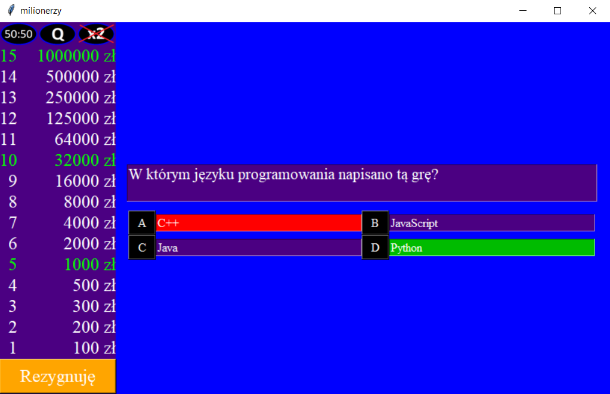

<h1 align="center">Who Wants to be a Millionaire?</h1>
<h3 align="center"><a href="https://github.com/TeeKay18/WWTBAM/releases">Latest release: 1.0.0-a3 (10th August 2020)</a></h3>

 

Lightweight version of Who Wants to be a Millionaire in Python using Tkinter. Under development with working prototype.

- Translation of 1st question: In which programming language this game was written?

### Features
- Customizable prices tree 
- Customizable music between questions
- Customizable questions file 
- Three lifelines: 
  * 50:50 - takes down randomly two incorrect answers
  * Q - switch the question 
  * x2 - double dip, you can select two answers (but cannot walk away after deciding to use this lifeline)
